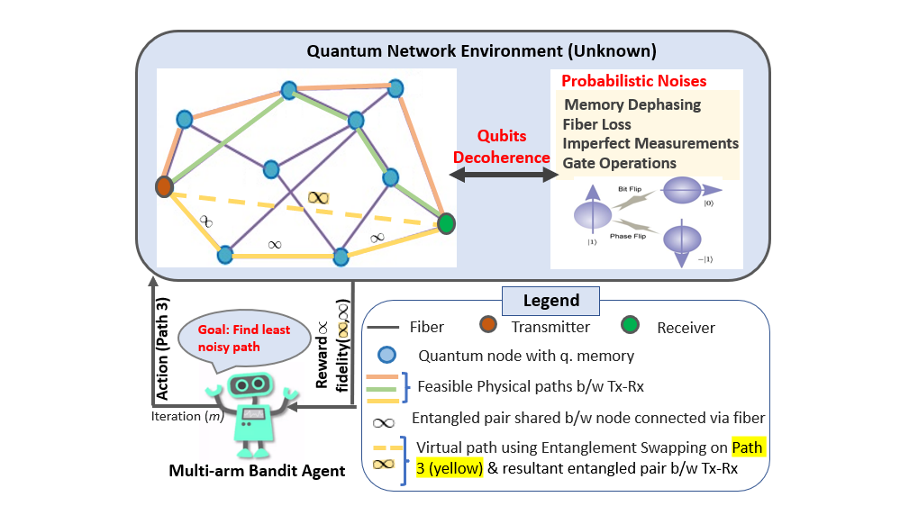
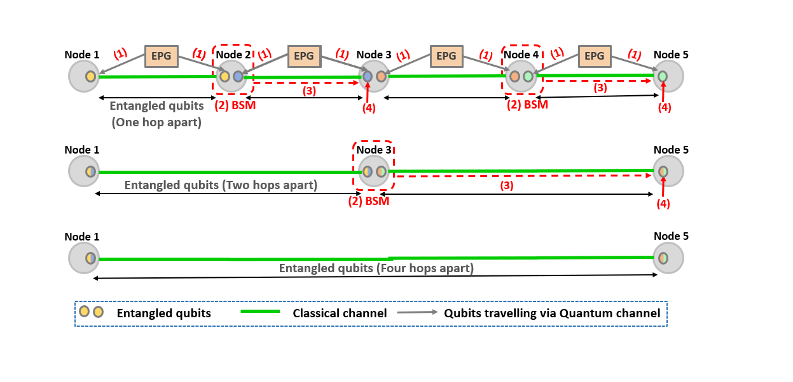

# Noisy Quantum Networks for Learning-based Route Selection
This MATLAB code simulates an Upper Confidence Bound-Multi Arm Bandit (UCB-MAB) algorithm in which a learning agent interacts with the quantum network environment and learns the least noisy path between a transmitter (Tx) and a receiver (Rx) over multiple iterations as shown in the figure below. 



This codebase creates a fully connected quantum network graph with user-defined number of nodes placed randomly in a desired area. It establishes a link between any two nodes whose distance is smaller than a configurable value. It considers an entangled pair generator (EPG) located midway on each link for generation of entangled pair and distribution of one of its entangled qubit to the downstream and upstream nodes each. To share an entangled qubits pair between Tx and Rx end nodes on a path, it simulates entanglement swapping at the intermediate nodes by carrying out the following steps:

(1) transmission of entangled qubits from EPG to the nodes forming that link, 

(2) performing Bell state measurements (BSM) on the two qubits (from different pairs) at the nodes based on an entanglement swapping order (here parallel),

(3) transmission of results of qubits’ measurements to the nodes on respective upstream classical links, and 

(4) perform gate operations on the qubits of these upstream links’ nodes to achieve entanglement with that on the respective downstream links’ nodes. 

This results in sharing entangled qubits between nodes that are more than one-hop apart, as shown in figure below. 



To reduce decoherence of qubits, swapping is done at multiple nodes in parallel and synchronized order. For instance, if a path with 5 nodes is given by {1−2−3−4−5}, then firstly the swapping will be done at nodes 2 and 4 to create virtual path {1−3−5} (level-i), followed by swapping at node 3 to generate virtual path {1 − 5} (level-ii). This codebase is written considering synchronized operations at the nodes involved in swapping at different levels. For instance, measurement in step (2) happens after all the nodes (here 2, 4) receive qubits from EPGs during level-i. Likewise, step (4) happens when classical information reaches all the respective nodes during each level [18].

For each set of nodes {i, j, k} connected via links i − j and j − k, the time required for operation in steps (1)-(4) while attempting swapping at node j are,
respectively, t<sub>f</sub> = (fiber link length)/(speed of photon in fiber) s, t<sub>BSM</sub> = 10 ns, t<sub>c</sub> = (classical link length)/(speed of light) s, and td = 10 ns [12], [17], where speed of photon in fiber = (speed of light/refractive index of fiber) = (3 × 10<sup>8</sup>/1.5) = 2 × 10<sup>8</sup>. This simulator considers depolarization noise for modeling loss in fiber, dephasing noise (phase-flip) in memory, bit flip error during BSM, and bit-phase flip error in gate operations. It generates the instances of these noises/errors in each iteration of our learning algorithm (UCB-MAB) with probabilities p<sub>depol</sub> = f (fiber length) [12], p<sub>dephas</sub> = f (time qubit sits in memory) [12], p<sub>BSM</sub> = 0.2, and p<sub>GateErrors</sub> = 0.2. The values of some of these parameters (shown in 'Files' Description and Configurable Parameters' section) are configurable.

This simulator is designed in MATLAB using QLib [16], which is a MATLAB package for quantum information theory calculations.

## Files' Description and Configurable Parameters
1. QNetworkGraph_LearningAlgo.m <b>(main file)</b>: Creates a quantum network graph with the following configurable parameters. After network creation, it calls function 'MAB_UCB_QNetwork_Routing.m' for running UCB-MAB algorithm for the least noisy route selection. 
```{eval=FALSE}
  - No_of_nodes = 15;                           % No. of nodes in the quantum network
  - x_min = -10; x_max = 10;                    % Define area spanned by network (20Km X 20Km for set values). Nodes locations are set based on this area.
  - Link_distance_Threshold = 10;               % A link is considered b/w any two nodes if the distance b/w the nodes is <= 'Link_distance_Threshold' Km
  - sources = 2;                                % Transmitter node
  - destination = 15;                           % Receiver node
  - p_init = 0.00001;                           % Probability of loss of entangled pair after generation
  - p_BSM = 0.2;                                % Probability of imperfect (or error in) BSM operation
  - p_GateErrors = 0.2;                         % Probability of occurrence of gate errors during swapping operations
  - r_dephase = 10000;                          % Dephasing rate of quantum memories
  - f_attenuation = 0.05;                       % Fibre Loss attenuation db/km
  - c_light = 3.0e8;                            % Speed of light
  - t_BSM = 10e-9;                              % Time taken for BSM operation
  - t_d = 10e-9;                                % Time taken for manipulation (gate) operations at end of link-level teleportation and entanglement swapping
  - refractive_index = 1.5;                     % Refractive index of fiber
  - rounds = 1400;                              % No. of iterations for exploration and exploitation by agent to learn the best route b/w Tx and Rx 
  - experiments = 600;                          % No. of runs of complete MAB algorithm (used to calculate average results, similar to monte-carlo iterations)
  - No_of_arms = 8;                             % No. of arms used in MAB algorithm
```
2. MAB_UCB_QNetwork_Routing.m: Contains function 'UCB' that calls 'Environment_QCNetwork.m' for intercation of MAB agent with the quantum environment unknown to it.

3. Environment_QCNetwork.m: Computes fiber-related losses using 'FiberLoss.m' file, probability of decoherence in memory and errors during BSM and gate operations using 'EntanglementSwap_NoiseProbabilities.m' file.

4. EntanglementSwap_NoiseProbabilities.m: Computes time each qubit spends in memories at different nodes before BSM and gate operations. These time values are used in calculation of probability of decoherence noise and errors.

5. EntanglementSwap_Noises.m: Generates instances of different errors with respective probabilities computed in parent function and performs entanglement swapping process on a set of three nodes.

6. Other files are called in the above files and have relevant comments of what they does in them.

Note: All files have comments to give context of what is being done in the code.

## Features
- The simulator (i) tracks time a qubit spends in memory, fiber, and gate operations during different steps (explained above) of entanglement swapping, (ii) calculates probability of occurrence of different noises, and (iii) generate them with these computed probabilities in every iteration. Thus, there is no need to create time events for each nodes, memories, and errors in different gate operation explicitly, which requires prior knowledge of when the dephasing and other noises will occur in different qubits at different nodes in a large-scale network. Hence, this simulator provides ease of use without requiring in-depth and accurate knowledge of timings
of different events. 

- It enables application of learning-based algorithms to interact with quantum network environment, which is not straight-forward with other existing simulators that mostly gives an average behavior of noises/errors on qubits’ density matrix. This simulator implements the effect of these errors on qubits’ states at every instance. 

## Prerequisites and dependencies
QLib - http://www.tau.ac.il/~quantum/qlib/qlib.html

MATLAB R2021b

## Getting Started
Simply clone the repository, open MATLAB (version 2021b), add QLib to your path (with subfolders), and run the 'QNetworkGraph_LearningAlgo.m' file.

## Citation
This simulator is a part of work 'Learning-based Route Selection in Noisy Quantum Communication Networks'. Please feel free to cite it as:

<b>V. Chaudhary, K. Li, and K. Chowdhury, "Learning-based Route Selection in Noisy Quantum Communication Networks", IEEE International Conference on Communications, 28 May-01 June 2023, Rome, Italy.</b>
